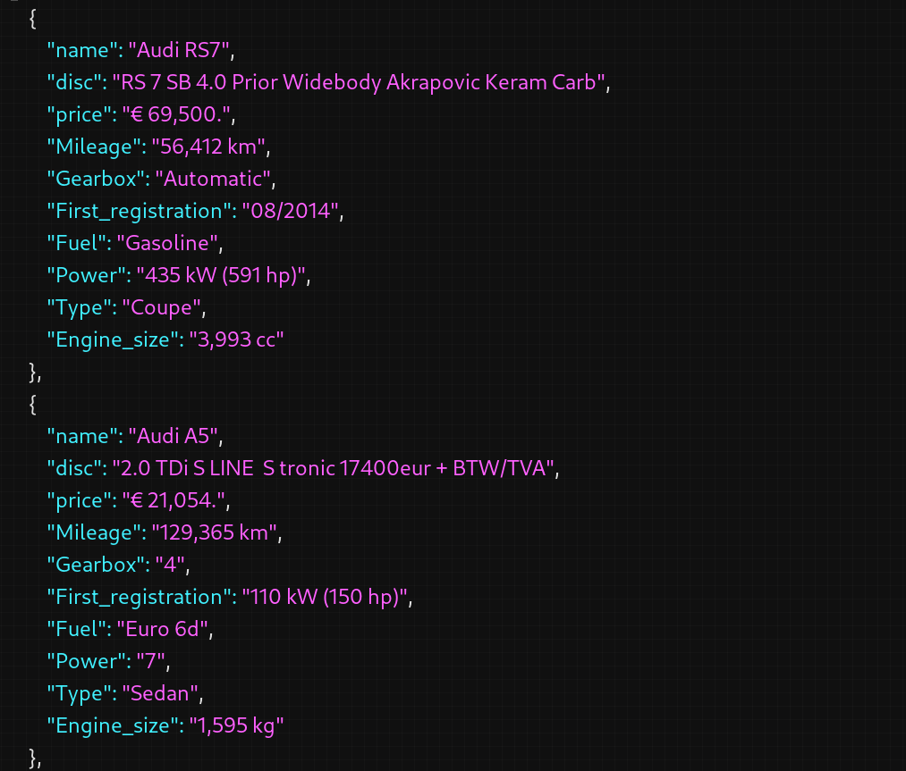

# Web Scraping Application using Python

This is a web scraping application built with Python, utilizing the structure of a Flutter authentication app. Instead of authentication functionalities, it scrapes data from web pages following the same structure.

<br><br>



<br>

## Features

- Web scraping functionality to extract data from web pages
- Ability to retrieve information about cars from various automotive websites.
- Capability to scrape product details from e-commerce platforms.
- Extract relevant information from various types of websites.

## Installation

1. Clone the repository: [Git Link](https://github.com/Abdou-009/Web-Scraping.git)
2. Navigate to the project directory.
3. Install dependencies: *(Dependencies may vary depending on the specific scraping libraries used)*

## Usage

- Run the script.
- Input the URL of the webpage you want to scrape data from.
- The script will extract relevant information from the webpage following the defined structure.
- Install dependencies using pip:

```bash
pip install httpx selectolax beautifulsoup4
```

## Dependencies

- [Python](https://www.python.org/)
- [HTTPX](https://pypi.org/project/httpx/)
- [Selectolax](https://pypi.org/project/selectolax/)
- [Beautiful Soup](https://pypi.org/project/beautifulsoup4/)
- [json](https://docs.python.org/3/library/json.html)
- [csv](https://docs.python.org/3/library/csv.html)
- [dataclasses](https://docs.python.org/3/library/dataclasses.html)
- [datetime](https://docs.python.org/3/library/datetime.html)


## Credits

This application structure was inspired by the authentication app created by [Abdou_009](https://github.com/Abdou_009).
